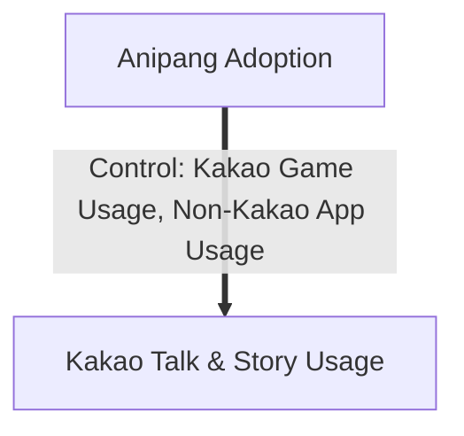

# Kakao-From-Games-to-Chats
### *A Panel DID study on how gaming app adoption influences social media usage.*

**Kakao** is a South Korean technology company that provides a wide range of digital services and mobile applications. It is best known for its messaging app **KakaoTalk** and networking app **KakaoStory**. In 2012, Kakao platform released its first-ever gaming app **"Anipang"** and it quickly became a hit. 

This project is interested in **how the adoption of a popular gaming app will affect users’ app usage behavior**.

## STEP1 Propensity Score Matching
