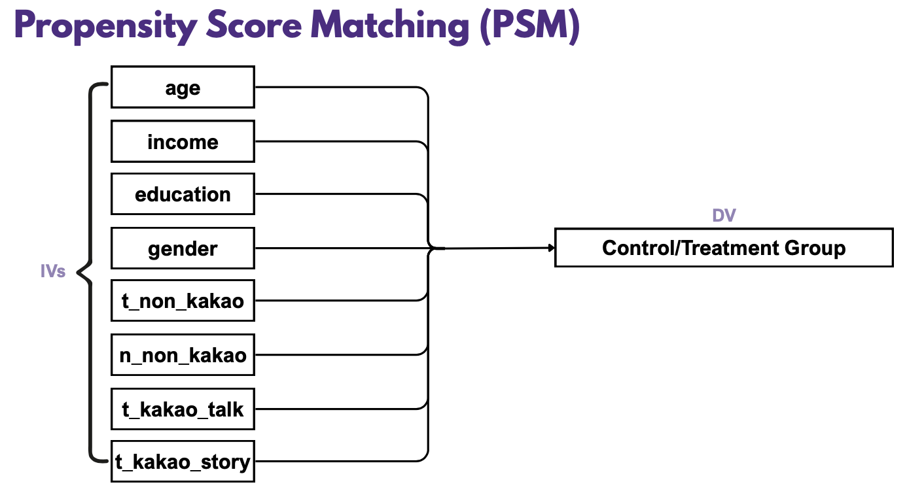

# Kakao-From-Games-to-Chats
### *A Panel DID study on how gaming app adoption influences social media usage.*

**Kakao** is a South Korean technology company that provides a wide range of digital services and mobile applications. It is best known for its messaging app **KakaoTalk** and networking app **KakaoStory**. In 2012, Kakao platform released its first-ever gaming app **"Anipang"** and it quickly became a hit. 

This project is interested in **how the adoption of a popular gaming app will affect users’ app usage behavior**.

```mermaid
graph TD
A[Anipang Adoption (Control/Treated)]
B[Kakao Talk & Story Usage]
A ==Control: Kakao Game Usage, Non-Kakao App Usage==> B
```

## STEP 1️⃣ Propensity Score Matching
The dataset consists of ***individual-level weekly panel data*** on app usage time collected from Android-based mobile devices. The sample includes ***849 users observed over a two-week period***.

There are 793 units in the control group (Anipang adoption = FALSE) and only 56 units in the treatment group (Anipang adoption = TRUE). The two groups differ significantly in terms of gender, age, education level, income, Kakao app usage, and non-Kakao app usage. **To ensure a more valid regression, propensity score matching (PSM) is conducted**.




After the PSM, we saw substantial improvement in the statistics from raw to matched data, which means **all matched groups are well balanced** and can be considered appropriate for further analysis.


## STEP 2️⃣ Panel DID Regression Model 1
t_kakao_talk = β0 + αi (panel_id)i + δt (week) + **β1ii** +
                                         β2 t_kakao_story + β3 t_kakao_game + β4 t_non_kakao + uit

- panel_id: unit fixed effect
- week: time fixed effect
- ii: treatment variable (anipang adoption)
- t_kakao_talk: time using kakao talk
- t_kakao_story: time using kakao story


In ten models using ten different PSM groups, the coefficients of treatment variable are all insignificant at 5% significance level.

However, the coefficients of Kakao Story usage are significant, which means the usage time of Kakao Story has a siginificantly positive impact on the usage time of Kakao Talk.

**Result**: The adoption of Anipang ***DOES NOT have a significant impact*** on the usage time of Kakao Talk at very early adoption stage (first week). 


## STEP 3️⃣ Panel DID Regression Model 2
t_kakao_story = β0 + αi (panel_id)i + δt (week) + **β1ii** +
                                         β2 t_kakao_talk + β3 t_kakao_game + β4 t_non_kakao + uit


In ten models using ten different PSM groups, the coefficients of treatment variable are all insignificant at 5% significance level. The coefficients of kakao talk usage provide the same result, which means an increase in usage time of Kakao Talk will not lead to an increase in the usage time of Kakao Story.

**Result**: The adoption of Anipang ***DOES NOT have a significant impact*** on the usage time of Kakao Story at very early adoption stage (first week). 

## STEP 4️⃣ Conclusion
Despite Anipang’s viral success, we found no significant immediate increase in the usage time of Kakao Talk (communication) or Kakao Story (social networking). This suggests that viral app adoption does not necessarily lead to an instant rise in usage of other apps within the same platform ecosystem.